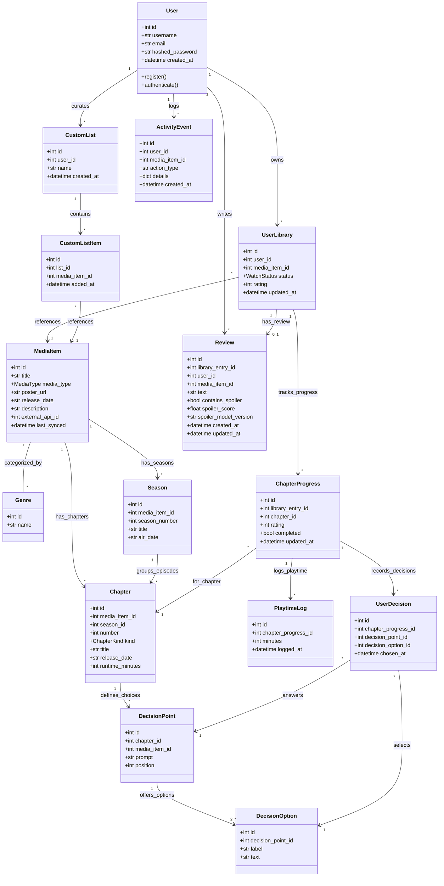

# OmniLog — UML Class Diagram

This document provides the UML Class Diagram of the **OmniLog** domain model (`backend/app/models/entities.py`) and core service classes (`backend/app/services/`).

```mermaid
classDiagram
  class User {
    +int id
    +str username
    +str email
    +str hashed_password
    +datetime created_at
    +register()
    +authenticate()
  }

  class MediaItem {
    +int id
    +str title
    +MediaType media_type
    +str poster_url
    +str release_date
    +str description
    +int external_api_id
    +datetime last_synced
  }

  class Genre {
    +int id
    +str name
  }

  class Season {
    +int id
    +int media_item_id
    +int season_number
    +str title
    +str air_date
  }

  class Chapter {
    +int id
    +int media_item_id
    +int season_id
    +int number
    +ChapterKind kind
    +str title
    +str release_date
    +int runtime_minutes
  }

  class DecisionPoint {
    +int id
    +int chapter_id
    +int media_item_id
    +str prompt
    +int position
  }

  class DecisionOption {
    +int id
    +int decision_point_id
    +str label
    +str text
  }

  class UserLibrary {
    +int id
    +int user_id
    +int media_item_id
    +WatchStatus status
    +int rating
    +datetime updated_at
  }

  class ChapterProgress {
    +int id
    +int library_entry_id
    +int chapter_id
    +int rating
    +bool completed
    +datetime updated_at
  }

  class PlaytimeLog {
    +int id
    +int chapter_progress_id
    +int minutes
    +datetime logged_at
  }

  class UserDecision {
    +int id
    +int chapter_progress_id
    +int decision_point_id
    +int decision_option_id
    +datetime chosen_at
  }

  class Review {
    +int id
    +int library_entry_id
    +int user_id
    +int media_item_id
    +str text
    +bool contains_spoiler
    +float spoiler_score
    +str spoiler_model_version
    +datetime created_at
    +datetime updated_at
  }

  class CustomList {
    +int id
    +int user_id
    +str name
    +datetime created_at
  }

  class CustomListItem {
    +int id
    +int list_id
    +int media_item_id
    +datetime added_at
  }

  class ActivityEvent {
    +int id
    +int user_id
    +int media_item_id
    +str action_type
    +dict details
    +datetime created_at
  }

  User "1" --> "*" UserLibrary : owns
  User "1" --> "*" CustomList : curates
  User "1" --> "*" ActivityEvent : logs
  User "1" --> "*" Review : writes
  MediaItem "*" -- "*" Genre : categorized_by
  MediaItem "1" --> "*" Season : has_seasons
  MediaItem "1" --> "*" Chapter : has_chapters
  Season "1" --> "*" Chapter : groups_episodes
  Chapter "1" --> "*" DecisionPoint : defines_choices
  DecisionPoint "1" --> "2..*" DecisionOption : offers_options
  UserLibrary "*" --> "1" MediaItem : references
  UserLibrary "1" --> "*" ChapterProgress : tracks_progress
  UserLibrary "1" --> "0..1" Review : has_review
  ChapterProgress "*" --> "1" Chapter : for_chapter
  ChapterProgress "1" --> "*" PlaytimeLog : logs_playtime
  ChapterProgress "1" --> "*" UserDecision : records_decisions
  UserDecision "*" --> "1" DecisionPoint : answers
  UserDecision "*" --> "1" DecisionOption : selects
  CustomList "1" --> "*" CustomListItem : contains
  CustomListItem "*" --> "1" MediaItem : references
```
